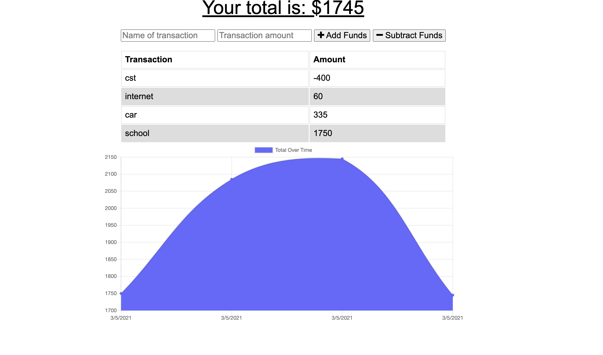

# Budget-Tracker

## Decription

* GIVEN a budget tracker without an internet connection<br>
WHEN the user inputs an expense or deposit<br>
THEN they will receive a notification that they have added an expense or deposit<br>
WHEN the user reestablishes an internet connection<br>
THEN the deposits or expenses added while they were offline are added to their transaction history and their totals are updated<br>

## Setup
```
git clone git@github.com:eramos3/Budget-Tracker.git
```

[Budget Tracker page](https://bdget-traker.herokuapp.com/)